# Maths-Family-games
implement Pascal's triangle, Stern sequence,  probability and  implement a scooby-doo game variant, simpsons and totally spies
In left there are  math games and in the right there are games for family  
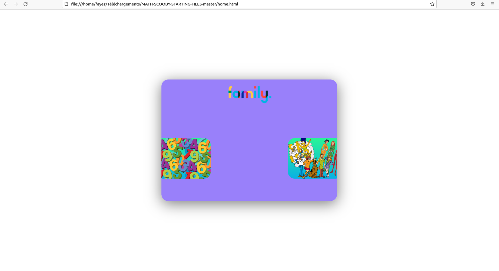 
We entre to the left  
 
If we clique on probability 
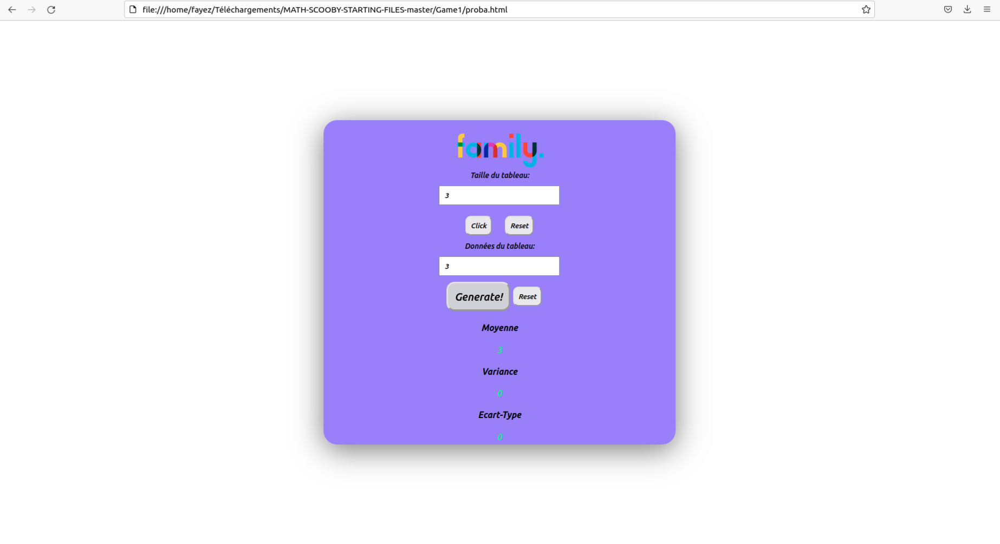 
We should entre the size of the table and click on the botton Click to memorize the size  
Fill the table with values then click on the button click it will appear a generate button  
And when you slide the mouse over it will display the variance, the average and the standard deviation  
Sources to calculate the variance: 
http://yallouz.arie.free.fr/premiere_cours/statistiques/stats.php?page=st2  
If we clique on Triangle Pascal  
We should entre a value and clique on the botton Valider it display the corresponding Pascal's triangle    
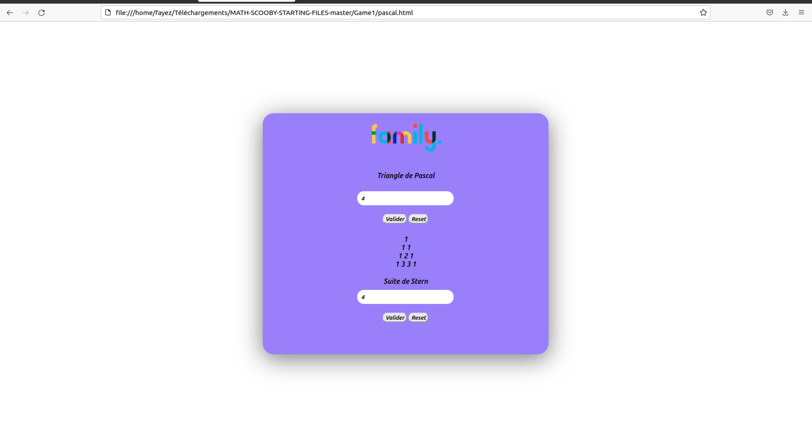 
And the same to display the corresponding stern sequence   
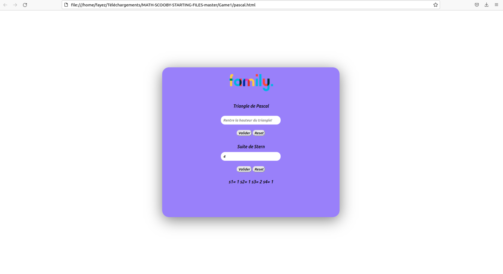 
the botton reset is to to refresh the page  
Small representation for stern sequence:   
 
Now ,we entre to the right (games for family)   
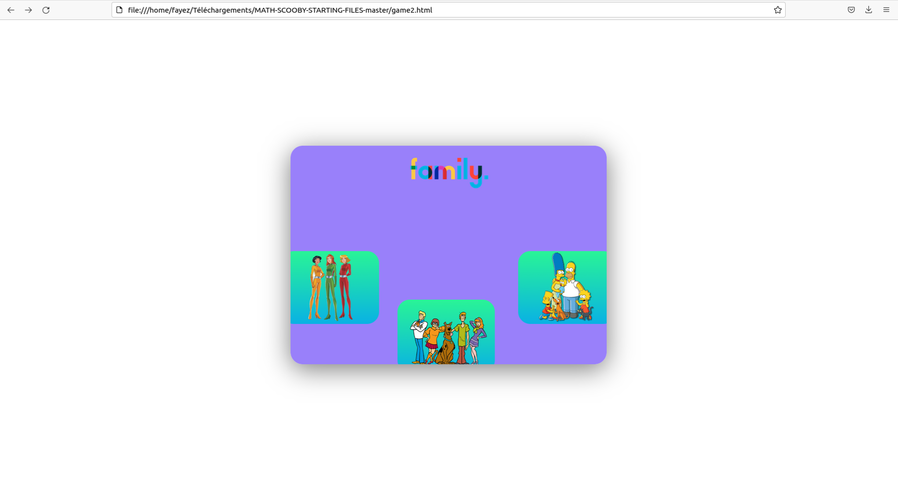 
The 3 games have the same principles  
Who will have the most score will win  
But there are rules if we lands on one of the wicked images the score will be reduced to Zero  
And the other player will resume the game  
The botton Roll dice to memorize the score 
The hold button to display the score  
And it is who reaches 200 will win and it will display winner   
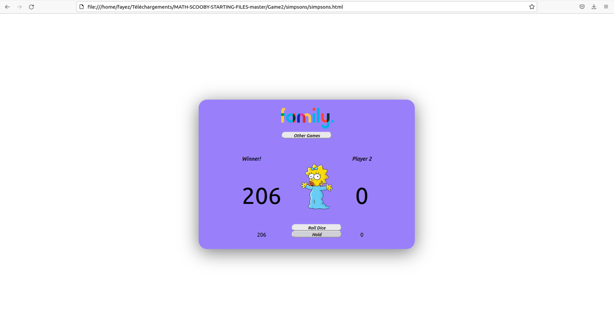 
Scoobydoo game :  
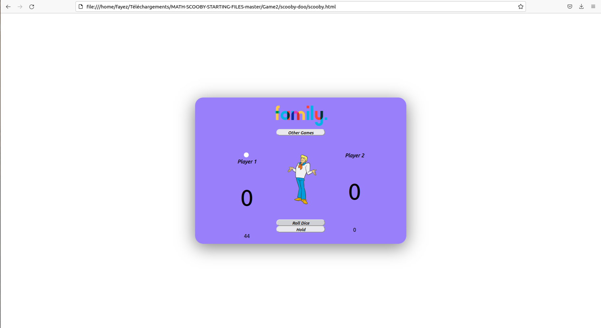 
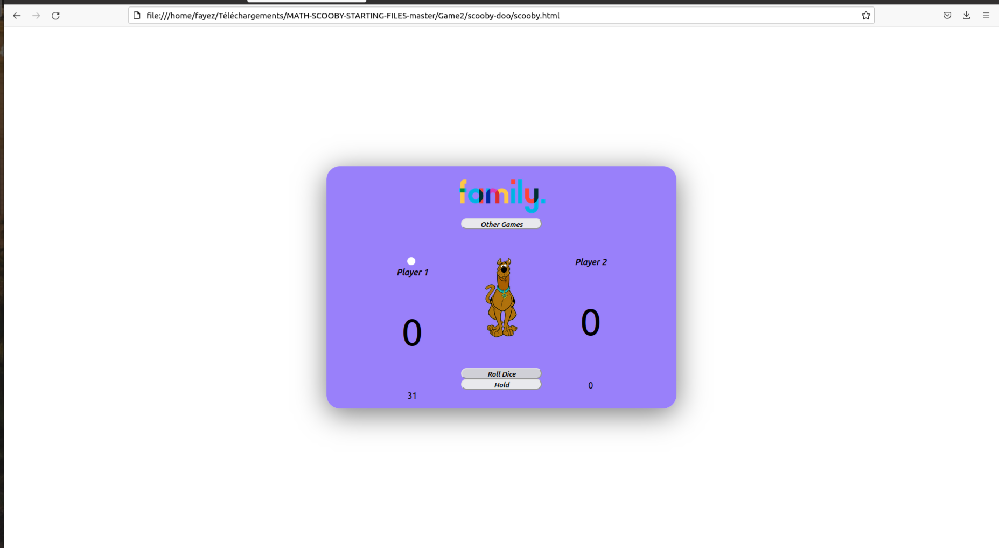  
Simpsons game:  
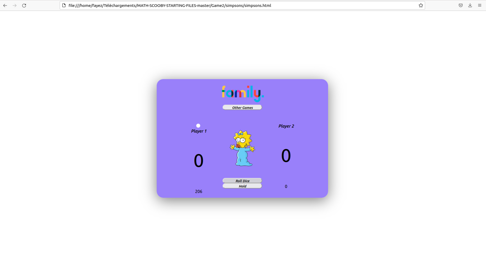 
Totally spies game:  
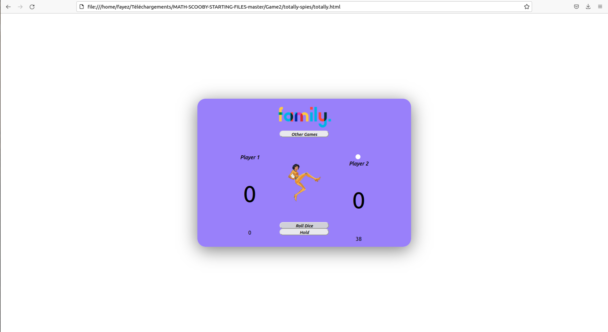  
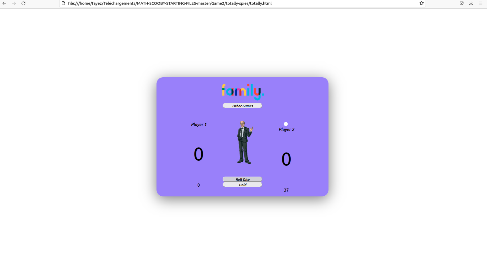  
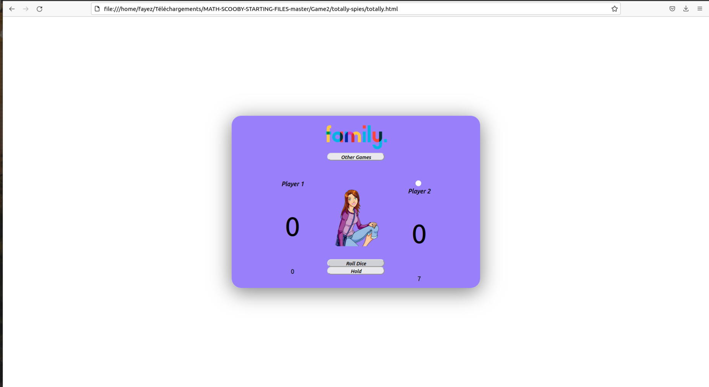  
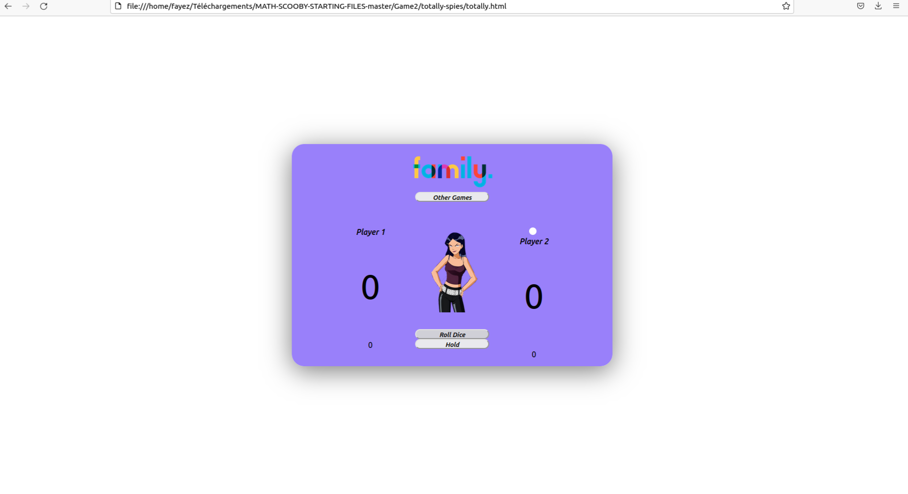  
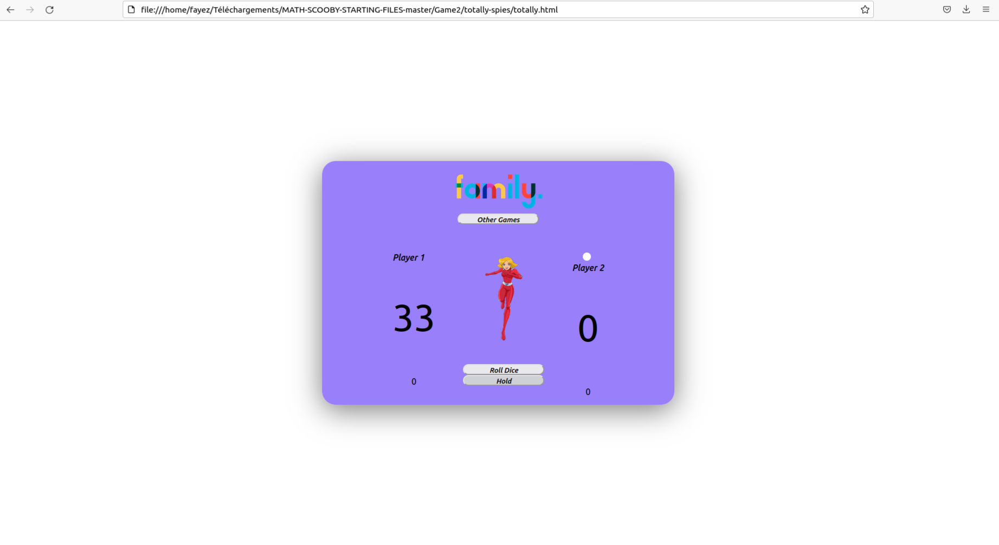  

